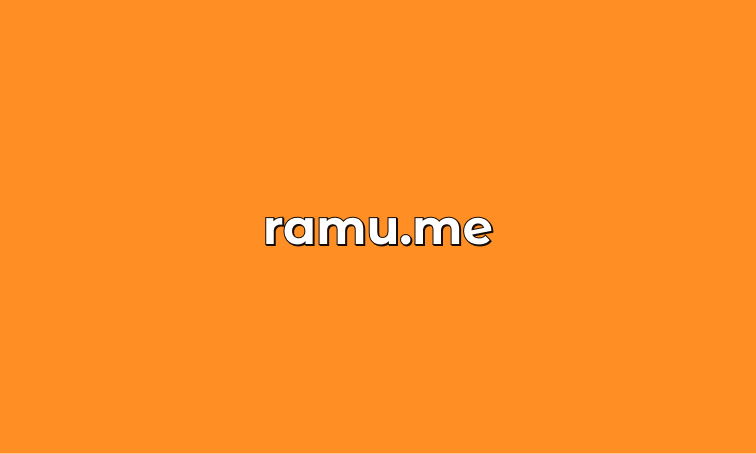

# Bhargava Ramu's Portfolio 👨‍💻

Welcome to the source code of my portfolio! You can check the live version at [ramu.me](https://ramu.me).

 

---

## Development Environment 🛠

- Node.js `v16.13`
- React `v18.2`

## Features & Concepts 🚀

- **Design System**: Created a mini design system using Figma with neo-brutalist style.

- **Themes**: Implemented both light and dark themes. The site respects the initial theme preference of the user's system.

- **3D Models**: Utilized [Spline](https://spline.design) to create unique and engaging 3D models.

- **Personal Touches**: The site features a representation of my room and an airport scene from my visit to Toulouse, making the user experience more personal and unique.

## References & Credits 🙏

- The loading spinner was inspired by this [CodePen by Fazley Rabby](https://codepen.io/fazley_rabby/pen/qBOwJbQ).

- The custom scrollbar was implemented based on this [tutorial by Zkreations](https://www.zkreations.com/2018/02/personalizar-scrollbar-facil-custom-scrollbars.html).

- Good looking simple favs from [Favicon generator](https://favicon.io/favicon-generator/)

- This project was developed with assistance from [ChatGPT](https://openai.com/research/chatgpt), a language model by [OpenAI](https://openai.com).

## Development Setup 💻

1. Clone the repository.
2. Install the required dependencies with `npm install`.
3. Start the local development server with `npm run dev`.

## Run Storybook 📚

- Execute `npm run storybook` to run storybook for component development and testing.

## Short Blog

I took a break to find the next opportunity in my career and decided to build a new website for myself as a frontend developer. Initially, I had grand ambitions and wanted to learn many new things and incorporate them into my site, including some storytelling techniques from [Awwwards](https://www.awwwards.com/). However, I deviated quite a bit from my original plans.

During my exploration, I came across [Spline](https://spline.design/), which felt like Figma for 3D design. Intrigued, I spent two weeks familiarizing myself with the tool and creating assets for my final project. Eventually, I started setting up the code and wanted to fully utilize Tailwind CSS. I got carried away while trying to understand the power of Tailwind, which added more time to my project.

To validate some design ideas, I decided to create a basic design in [Figma](https://figma.com/). But rather than using an existing design system, I challenged myself to create a mini design system with a neo-brutalist style. I found this design language simple and elegant (but not accessible always 😅)

Once I started coding, I also had the idea to document my components. It was the perfect opportunity to explore Storybook. Although there were moments of frustration and the temptation to abandon the project and focus on interview preparation, I pushed through. ChatGPT provided valuable support, clarifying my doubts since I had no one to discuss my UI ideas with. (Included in this README) 🤖

Finally, I am grateful for the support from my brother and friend, who encouraged me to continue and not view it as time wasted. I thoroughly enjoyed the process and am proud of the skills I acquired along the way. [This old portfolio website](saibhargavaramu.github.io) holds significance for me as it is the first site I created when I was starting to learn HTML and CSS after getting into the job 😎 (Actually, there is one more site, but I used Dreamweaver, so it doesn't count. Also, it's goofy!) 😜
